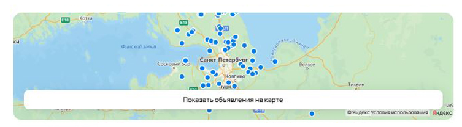

# Тестовое задание для стажёра QA-направления

## Задание 1

## Общие предусловия (для всех багов)

1. Перейти в раздел **«Посуточная аренда»**
2. Установить фильтры:
   - Тип аренды: **Посуточно**
   - Даты: **1 и 4 июня 2025**
   - Количество гостей: **3**
   - Цена до: **50 000 ₽**
   - **Без залога**
   - Пешком до метро: **5 минут**
   - **Можно с животными**
   - Регион: **Москва и МО**
3. Нажать кнопку **«Найти»**

### Баг 1 – На странице результатов выводятся объявления, не соответствующие фильтрам, несмотря на сообщение "Ничего не найдено..."

#### Фактический результат

- На странице сначала отображаются карточки с объявлениями, которые не соответствуют установленным фильтрам (например, по цене, типу жилья или региону).

- После этого под карточками появляется блок:
"Ничего не найдено в выбранной области поиска..."

#### Ожидаемый результат

- Если фильтрам не соответствует ни одно объявление, то не должны отображаться карточки объявлений.

- Должно выводиться только сообщение "Ничего не найдено в выбранной области поиска..".

#### Приоритет

**High** – ошибка, влияющая на пользовательский опыт.

---

### Баг 2 – Некорректная работа фильтра по городу

#### Фактический результат

Отображаются объявления из Санкт-Петербурга, Красного Села и других регионов, несмотря на выбранный фильтр "Москва и МО".

#### Ожидаемый результат

Только объявления из Москвы и МО.

#### Приоритет

**High** – критическая ошибка, влияющая на релевантность поиска.

---

### Баг 3 – Некорректная работа фильтра по типу аренды

#### Фактический результат

Показываются объявления с помесячной оплатой при установленном фильтре "Посуточно".

#### Ожидаемый результат

Показ только объектов с посуточной оплатой.

#### Приоритет

**High** – критическая ошибка в работе фильтра.

---

### Баг 4 – Некорректная работа фильтра по цене

#### Фактический результат

Показываются объявления с ценой выше 50 000 ₽.

#### Ожидаемый результат

Объявления должны соответствовать фильтру "до 50 000 ₽".

#### Приоритет

**High** – критическая ошибка в работе фильтра.

---

### Баг 5 – Ошибка в сортировке по дате

#### Фактический результат

Объявления не отсортированы от новых к старым при выбранной сортировке "По дате".

#### Ожидаемый результат

Сортировка должна работать по убыванию даты публикации.

#### Приоритет

**Medium** – ошибка, влияющая на пользовательский опыт.

---

### Баг 6 – Некорректный текст на кнопке поиска

#### Фактический результат

На кнопке отображается "Найт" вместо "Найти".

#### Ожидаемый результат

Полный текст: "Найти".

#### Приоритет

**Low** – косметическая ошибка.

---

### Баг 7 – Ошибка в хлебных крошках

#### Фактический результат

В хлебных крошках навигации неверное название текущей страницы:
> "Главная > Недвижимость > Дата, дачи, коттеджи > Снять > На длительный срок"

#### Ожидаемый результат

Навигация должна содержать:
> "Главная > Недвижимость > Дата, дачи, коттеджи > Снять > Посуточно"

#### Приоритет

**Low** – ошибка влияет на удобство навигации.

---

### Баг 8 – Несоответствие количества объявлений

#### Фактический результат

Заголовок страницы сообщает, что найдено 6 объявлений, но в блоке фильтрации указано "Ничего не найдено".

#### Ожидаемый результат

Корректная информация о количестве объявлений, соответствующая реальному результату.

#### Приоритет

**Low** – ошибка влияет на восприятие информации.

---

### Баг 9 – Ошибка в пагинации

#### Фактический результат

Пагинация отображает 4 страницы, несмотря на сообщение "Ничего не найдено".

#### Ожидаемый результат

Пагинация не должна отображаться при отсутствии результатов.

#### Приоритет

**Low** – ошибка влияет на восприятие информации.

---

### Баг 10 – Ошибочный формат отображения объявлений

#### Фактический результат

Несмотря на выбранный режим отображения "На карте", объявления показываются плиткой.

#### Ожидаемый результат

Объявления отображаются на карте.

#### Приоритет

**High** – ошибка, влияющая на пользовательский опыт.

---

### Баг 11 – Карта отображается при пустой выдаче

#### Фактический результат

Даже при сообщении "Ничего не найдено", на карте отображаются метки.

#### Ожидаемый результат

Если объявлений нет — карта пустая или не отображается вовсе.

#### Приоритет

**Meduim** – ошибка влияет на восприятие информации.
