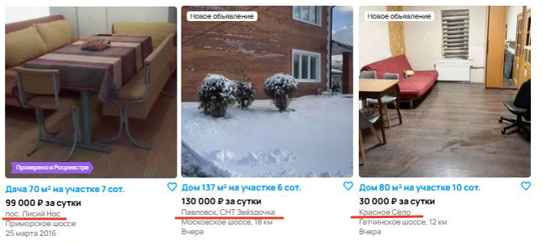
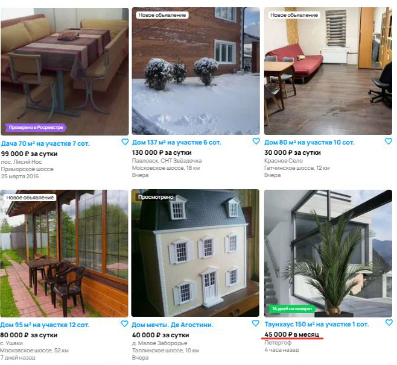
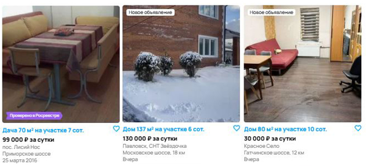
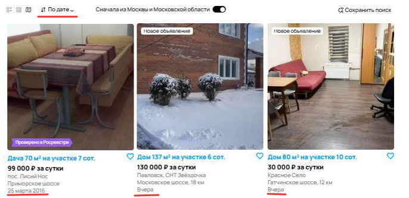
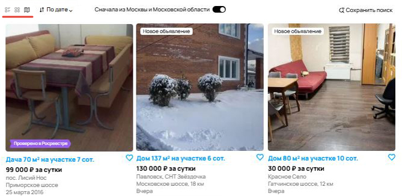

# Тестовое задание для стажёра QA-направления

## Задание 1

### Баг 1 – На странице результатов выводятся объявления, не соответствующие фильтрам, несмотря на сообщение "Ничего не найдено..."

#### Фактический результат

- На странице сначала отображаются карточки с объявлениями, которые не соответствуют установленным фильтрам (например, по цене, типу жилья или региону).

- После этого под карточками появляется блок:
"Ничего не найдено в выбранной области поиска..."

#### Ожидаемый результат

- Если фильтрам не соответствует ни одно объявление, то не должны отображаться карточки объявлений.

- Должно выводиться только сообщение "Ничего не найдено в выбранной области поиска..".

#### Приоритет

**High** – ошибка, влияющая на пользовательский опыт.

---

### Баг 2 – Некорректная работа фильтра по городу

#### Фактический результат

На первой странице присутствует объявление из города Санкт-Петербург, несмотря на установленный фильтр "Москва и МО".

#### Ожидаемый результат

Должны отображаться объявления только из выбранного города (Москва и МО).

#### Приоритет

**High** – критическая ошибка, влияющая на релевантность поиска.

---

### Баг 3 – Некорректная работа фильтра по длительности аренды

#### Фактический результат

Выводятся объявления с разной длительностью аренды, несмотря на установленный фильтр "Посуточно".

#### Ожидаемый результат

Должно отображаться жилье только с посуточной оплатой.

#### Приоритет

**High** – критическая ошибка в работе фильтра.

---

### Баг 4 – Некорректная работа фильтра по цене

#### Фактический результат

Выводятся объявления с ценой выше 50 тысяч рублей, несмотря на установленный фильтр до 50 тысяч.

#### Ожидаемый результат

Должно отображаться жилье только с ценой до 50 тысяч рублей.

#### Приоритет

**High** – критическая ошибка в работе фильтра.

---

### Баг 5 – Ошибка в сортировке объявлений

#### Фактический результат

При установленной сортировке "По дате" объявления не отсортированы по убыванию даты.

#### Ожидаемый результат

Объявления должны сортироваться от новых объявлений к старым.

#### Приоритет

**High** – критическая ошибка, влияющая на пользовательский опыт.

---

### Баг 6 – Ошибка в отображении текста на кнопке поиска по объявлениям

#### Фактический результат

На кнопке отображается текст "Найт" вместо "Найти".

#### Ожидаемый результат

Текст кнопки должен быть полностью виден: "Найти".

#### Приоритет

**Low** – косметическая ошибка.

---

### Баг 7 – Ошибка в навигации по страницам

#### Фактический результат

В хлебных крошках навигации неверное название текущей страницы:
> "Главная > Недвижимость > Дата, дачи, коттеджи > Снять > На длительный срок"

#### Ожидаемый результат

Навигация должна содержать:
> "Главная > Недвижимость > Дата, дачи, коттеджи > Снять > Посуточно"

#### Приоритет

**Low** – ошибка влияет на удобство навигации.

---

### Баг 8 – Несоответствие количества объявлений

#### Фактический результат

Заголовок страницы сообщает, что найдено 6 объявлений, но в блоке фильтрации указано "Ничего не найдено", а пагинация показывает 4 страницы.

#### Ожидаемый результат

Должна отображаться корректная информация о количестве объявлений.

#### Приоритет

**Low** – ошибка влияет на восприятие информации.

---

### Баг 9 – Неверная пагинация

#### Фактический результат

Пагинация показывает 4 страницы.

#### Ожидаемый результат

Пагинации быть не должно, так как объявлений по данному запросу не нашлось.

#### Приоритет

**Low** – ошибка влияет на восприятие информации.

---

### Баг 10 – Ошибочное отображение объявлений

#### Фактический результат

Объявления отображаются в плиточном виде, несмотря на установленный режим "С картой".

#### Ожидаемый результат

Объявления должны отображаться в выбранном пользователем виде (с картой).

#### Приоритет

**High** – ошибка, влияющая на пользовательский опыт.
